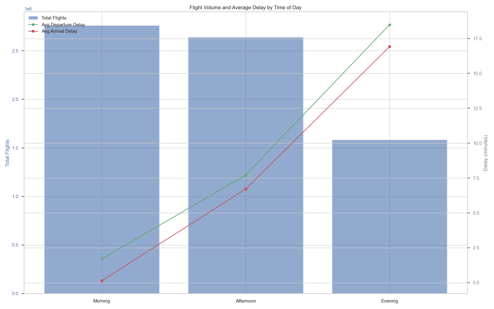

# ✈️ Airline On-Time Performance Analysis (2004) 

## 📌 Project Overview | 项目概述

This project analyzes the **Airline On-Time Performance** dataset for the year **2004**, sourced from [Kaggle](https://tinyurl.com/u8rzvdsx). 
This project aims to analyze airline on-time performance and cancellations, identifying underperforming routes, carriers, and flight numbers, and investigating the key reasons behind delays and cancellations. Using the 2004 US domestic flight data, we aim to provide insights for optimizing airline operations and assisting traveler decisions.
The project focuses on the following core questions: 

1.  Delay patterns by time of day, day of the week, and season;
2.  Top contributing factors to flight delays and their quantitative impact;
3.  Analysis of flight cancellation reasons and trends;
4.  Identification and diagnosis of consistently problematic flights, routes, or carriers.

Data was processed using Hive to clean and aggregate large-scale datasets. The resulting summaries were exported as CSV files, and visualizations were created in Jupyter Notebook using Python libraries such as pandas, matplotlib, and seaborn.

本项目使用来自 [Kaggle](https://tinyurl.com/u8rzvdsx) 的“航班准点表现”数据集旨在分析航空公司航班准点率与取消情况，识别航线、航空公司、航班号等维度下的表现不佳者，并探索延误和取消的主要原因。通过分析2004年美国航空运输数据，我们希望为航空运营优化和乘客出行决策提供有价值的参考。

项目内容涵盖以下几个核心问题：

1.  不同时间段、星期几、月份的延误模式；

2.  导致航班延误的主要因素及其影响程度；

3.  航班取消的原因分析；

4.  表现最差的航线、承运人和航班号，并对问题航班进行深入探讨。

数据处理部分使用 Hive 对大规模原始数据进行清洗与聚合，最终结果导出为 CSV 文件；可视化分析部分在 Jupyter Notebook 中利用 Python 的 pandas、matplotlib 和 seaborn 库完成。

---

## 📂 Dataset Description | 数据集说明

- **Year | 年份**: 2004  
- **Source | 来源**: U.S. Department of Transportation  
- **Fields | 字段**: Flight date/time, carrier, origin/destination, delay/cancellation reasons, etc.  
  航班日期/时间、航空公司、起点/终点、延误/取消原因等

---

## 🔍 Visualizations  & Analysis 

### 1. Delay Patterns | 延误模式分析
- ⏰ Which time of day has the lowest average delays?  
  哪个时段（早/中/晚）平均延误最少？
 
  

  该图展示了2004年一天中不同时段（早晨、下午、晚上）的航班总量和平均延误时间。蓝色柱状图表示航班总量，绿色线表示平均起飞延误（分钟），红色线表示平均到达延误（分钟）。如图所示早上的航班总量最大，且平均的延误时间最低；晚上的航班量最小但是平均的延误时间最高。

  总而言之，在所采用的2004年数据集中体现出来的是：早晨时段的平均延误时间最少，相较于下午和晚上。这可能归因于多个因素。早晨是航班起降的高峰时段，尽管航班数量多，但航空公司可能在早晨安排了更充足的资源和更紧凑的调度，以确保航班按时起飞。而晚上由于一天的累积效应，前面航班的延误可能会对后续航班产生连锁反应，导致晚上航班的延误时间更长。

  
- 📅 Which weekdays have better on-time performance?  
  星期几的航班更准时？
  图On-Time Rate by Day of Week

  该柱状图展示了2004年每周各天的航班准点率。横轴表示一周中的天数（1到7，1代表周一），纵轴表示准点率（0到1）。如图所示周一、周四、周五和周七的准点率较低（0.62-0.64），剩下的准点率相对较高（0.68-0.69），但实际上差别不是很大。
  
   工作周的中间几天通常航班流量较低，航空公司可能更容易管理调度和维护，从而保持较高的准点率。相比之下，周末和周五由于商务旅行和休闲旅行的增加，航班流量较大，增加了延误的可能性。
  

  
- 🗓️ Which months are most punctual?  
  哪些月份航班更准时？
 图On-Time Rate by Month

  该折线图展示了2004年每个月的航班准点率。横轴表示月份（1到12月），纵轴则表示准点率（0到1）。从图中可以看到，准点率在9月达到最高点（74%），而12月的准点率最低（56%）。
  航班在9月以及冬季的1月和2月最有可能准点。9月天气稳定，旅游需求较低，航空公司能够高效运营，准点率达到了全年的最高点0.74。相比之下，12月由于年末假期，旅游需求激增，航班流量大幅增加，导致机场拥堵和运营压力增大，准点率降至全年最低的0.568。此外，12月的冬季天气状况（如暴风雪和结冰）也给航班运营带来了挑战.
  

  

  

### 🔝2. Delay Factors | 延误因素分析
  

 图表2：Proportion of Delay Factors

该饼图展示了2004年美国航班延误的主要因素及其占总延误时间的百分比.

图表1：Total Delay Minutes by Factor

该柱状图展示了2004年美国航班延误的主要因素及其总延误时间（以分钟为单位）。横轴表示总延误时间，纵轴表示延误类型。

   结合图1和图2可知，飞机晚到和国家空管系统问题是导致航班延误的主要因素，两者合计占总延误时间的约67.1%。这表明航空系统内部的协调和管理问题对航班准点率有着显著影响。航空公司原因占总延误时间的约25.8%，这可能与航空公司的运营效率、飞机维护、机组人员调度等因素有关。天气原因占总延误时间的约6.9%，虽然比例相对较小，但在实际运营中仍然是一个不可忽视的因素，尤其是在恶劣天气频发的季节或地区。安全原因占总延误时间的约0.2%，表明安全检查和相关程序对航班延误的影响极小。

### 🐱3. Cancellation Analysis | 取消航班分析

  图表1：Statistics on the number of flight cancellations at different times
  该图展示了早中晚的航班取消数量。X轴为取消数量，Y轴是时间段。
  如图所示，下午的取消数量最高，达到51,782次，这可能与当天的航班运营压力有关。随着一天中航班的进行，机械问题、天气变化或其他运营挑战可能导致更多的取消。
上午的取消数量次之，为45,834次，这可能与夜间天气状况或航空公司的运营准备有关。
晚上的取消数量最少，为30,141次，这可能是因为晚上航班总量本身较少，或者航空公司和机场在晚上更能够应对导致取消的问题。

  图表2：Monthly Cancellation Rate
  该图体现的是2004年各个月份的取消率，横轴表示月份，纵轴表示取消率（%）。
  取消率在1月和9月达到最高点（3.0%），这可能与这两个月的特定天气条件或运营压力有关。1月的冬季天气可能导致更多的取消，而9月可能受到季节过渡期天气变化的影响。
取消率在4月达到最低点（0.8%），这表明该月的运营相对平稳，可能与适中的天气条件和较低的旅游需求有关。
年末的12月取消率上升至2.8%，这可能与假期旅游高峰有关，增加了航班运营的复杂性。

  图表3：Flight Cancellation Rate by Departure Airport TOP 20
  该柱状图展示了取消率最高的前20个出发机场。横轴表示取消率（%），纵轴表示机场代码。其中DUT（32.73%）和PUB（33.33%）的取消率显著高于其他出发机场。

  图表4：Cancellation Reasons
  该柱状图展示了航班取消的主要原因。横轴表示取消次数，纵轴表示取消原因代码。
  航空公司原因是航班取消的最主要原因，占总取消次数的大部分。这可能包括机械故障、机组人员问题、航空公司的运营决策等。
天气原因是第二大取消原因，表明天气条件对航班运营有显著影响。
国家空管系统原因的取消次数显著高于天气原因，但次于前面两大原因，表明空管系统原因对航班的正常运营有一定且不小的影响
安全原因的取消次数相对较少，表明这些因素对航班取消的影响较小。
  
  

- 🧭 Primary cancellation reasons  
##### 主要取消原因
航空公司原因是航班取消的最主要原因，占总取消次数的大部分。这可能包括机械故障、机组人员问题、航空公司的运营决策等。天气条件是第二大取消原因，表明恶劣天气对航班运营有显著影响。国家空管系统原因（如空中交通拥堵和调度问题）是第三大取消原因，对航班的正常运营有一定且不小的影响。而安全原因导致的取消次数相对较少，表明这些因素对航班取消的影响较小。
   
对特定时间段的取消率进行分析可知：取消次数在下午最高（51,782次），可能与航班运营压力有关。随着一天中航班的进行，机械问题、天气变化或其他运营挑战可能导致更多的取消。上午的取消次数次之（45,834次），可能与夜间天气状况或航空公司的运营准备有关。晚上的取消次数最少（30,141次），可能是因为晚上航班总量较少，或者航空公司和机场在晚上更能够应对导致取消的问题。
对特定月份的取消率进行分析可知：取消率在1月和9月达到最高点（3.0%），这可能与这两个月的特定天气条件或运营压力有关。1月的冬季天气可能导致更多的取消，而9月可能受到季节过渡期天气变化的影响。取消率在4月达到最低点（0.8%），表明该月的运营相对平稳，可能与适中的天气条件和较低的旅游需求有关。年末的12月取消率上升至2.8%，这可能与假期旅游高峰有关，增加了航班运营的复杂性。
对特定机场的取消率进行分析可知：取消率最高的前20个出发机场中，DUT（32.73%）和PUB（33.33%）的取消率显著高于其他机场。这表明这些机场可能存在特定的运营或天气相关挑战。其他如ACK（11.16%）和ADQ（10.87%）等机场也表现出较高的取消率，表明这些机场在处理航班运营方面可能存在一定的挑战，需要进一步调查具体原因

  

### 🔍4. Problematic Routes | 问题航线分析
 图表1：Problem Routes: Cancellation Rate vs Average Arrival Delay
 
 该散点图展示了问题航线的取消率与平均到达延误之间的关系。横轴表示取消率（%），纵轴表示平均到达延误（分钟）。不同颜色的点代表不同的出发机场，点的大小表示总航班数量。取消率较高的航线通常也伴随着较高的平均到达延误。例如，某些航线的取消率超过12%，平均到达延误超过20分钟。

 图表2：The flight number with the highest cancellation rate

 该柱状图展示了取消率最高的航班编号。横轴表示取消率（%），纵轴表示航班编号。某些航班编号的取消率显著高于其他航班，例如航班编号4231的取消率超过25%。高取消率的航班可能集中在特定航线上，这可能与这些航线的天气条件或机场设施有关。

 图表3：Stacked Bar Chart of Delayed Reasons for Problem Flights

 该堆叠柱状图展示了问题航班的延误原因。横轴表示航班编号，纵轴表示平均延误时间（分钟）。不同颜色表示不同的延误类型。国家空管系统延误（avg nas delay）和飞机晚到（avg late aircraft delay）是主要的延误原因，分别占据较大比例。国家空管系统的延误表明整个航空系统可能存在效率问题，需要系统性的改进。国家空管系统的延误表明整个航空系统可能存在效率问题，需要系统性的改进。航空公司需要在调度和资源管理上采取措施，以减少这些因素对航班的影响。

 图表4：Carrier Analysis: Cancellation Rate vs Average Departure Delay

该散点图展示了航空公司的取消率与平均起飞延误之间的关系。横轴表示取消率（%），纵轴表示平均起飞延误（分钟）。不同颜色的点代表不同的航空公司，点的大小表示总航班数量。某些航空公司的取消率和平均起飞延误都较高，例如US和HP航空公司的取消率超过3%，平均起飞延误超过8分钟。
 

  

---

## 🧪 Using tools and files | 使用工具与文件

- **Data Querying | 数据查询**: Apache Hive 
- **Data Analysis & Visualization | 数据分析与可视化**: Python (Pandas, Matplotlib, Seaborn) 
- **IDE**: Jupyter Notebook  

---

## 📈 Tips 

> 🖼️ Insert chart previews or links here  
> 📊 此处插入你生成的图表或其预览/链接

---

## 🗃️ Folder Structure | 项目目录结构

